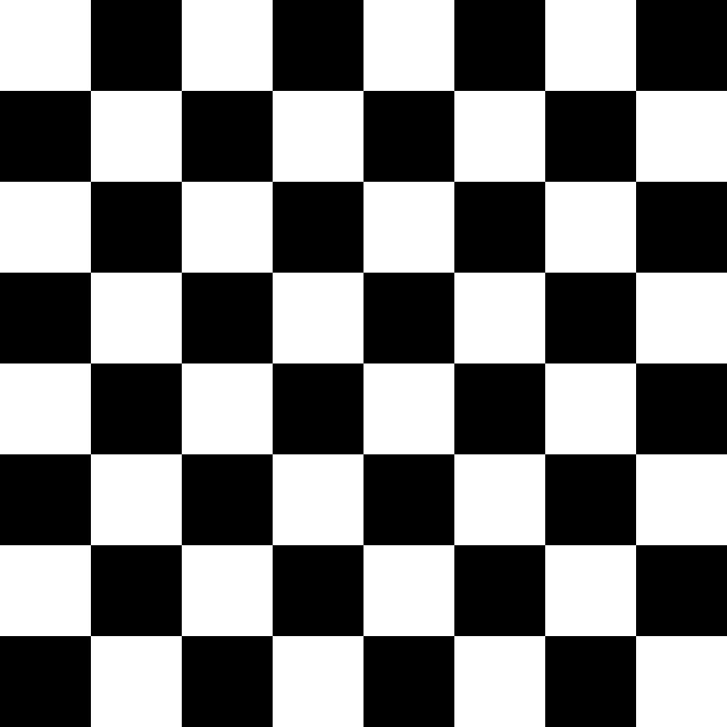
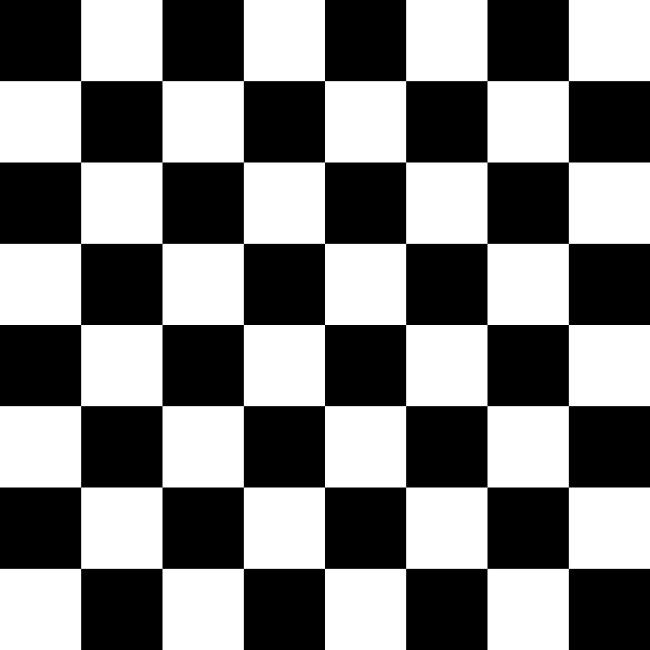
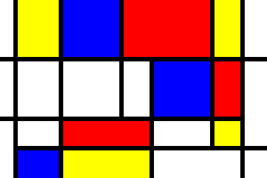
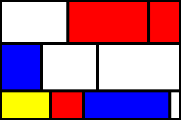

# Práctica 1 - Visión por Computador
## Marcial Galván - Alejandra Rodríguez

Resolución de la primera práctica de la asignatura Visión por Computador, en la que se busca aprender sobre:
- Representación de imágenes con distinto número de canales (grises, color)
- Creación de imágenes de distintos tamaños
- Acceso y modificación de los valores de los píxeles de una imagen
- Dibujo de primitivas básicas sobre una imagen
- Acceder a una imagen de disco, a los fotogramas de un vídeo o a la captura de una cámara

### Tabla de contenidos
- [Tarea 1 - Tablero de ajedrez](#tarea-1---tablero-de-ajedrez)
    - [Resolución manual](#resolución-manual)
    - [Resolución con inteligencia artificial](#resolución-con-inteligencia-artificial)
- [Tarea 2 - Arte al estilo de Mondrian](#tarea-2---arte-al-estilo-de-mondrian)
- [Tarea 3 - Detección de píxeles en vídeo](#tarea-3---detección-de-píxeles-en-vídeo)
- [Tarea 4 - Pop Art al estilo de Warhol](#tarea-4---pop-art-al-estilo-de-warhol)
- [Tarea Extra](#tarea-extra)
- [Fuentes consultadas](#fuentes-consultadas)

### Tarea 1 - Tablero de ajedrez

#### Resolución Manual

#### Resolución con Inteligencia Artificial

| Manual | Claude | ChatGPT | Gemini |
|--|--|--|--|
|  |  |  |  |

### Tarea 2 - Arte al estilo de Mondrian

El objetivo de esta tarea es la familiarización con las funciones de dibujo de OpenCV, concretamente `cv2.line` y `cv2.rectangle`. Con ellas, se debe imitar el estilo de Mondrian, generando una obra con líneas y rectángulos de colores primarios.
  
Para ello, primero se ha resuelto la tarea de forma _naïve_, pintando las figuras una a una, para dominar el uso de estas funciones. Se ha recreado a través de ellas el ejemplo proporcionado en el enunciado:

Este es el resultado obtenido:

A continuación, a modo de reto, se ha implementado la función `paint_mondrian`, que permite generar composiciones mondrianas aleatoriamente. Este es un ejemplo de obra generada a través de esta función:

### Tarea 3 - Detección de píxeles en vídeo

En esta tarea se recibe la entrada de la cámara, y se debe procesar para detectar el píxel más claro y el más oscuro en cada fotograma.
  
Para encontrar los píxeles correspondientes, se ha hecho uso de la función `cv2.minMaxLoc`. Dos de los parámetros de salida de esta función (`min_loc`, `max_loc`), indican las coordenadas del píxel más claro y el más oscuro de la imagen. 
  
Estas posiciones se utilizan como centro de dos círculos, dibujados para destacar los píxeles indicados. Se utiliza el color rojo para el píxel más claro, y el azul para el píxel más oscuro:

### Tarea 4 - Pop Art al estilo de Warhol

En esta tarea se realiza una creación warholiana, jugando con los valores de los distintos planos de color.
  
La composición muestra la entrada de la cámara un total de 9 veces, en un collage de 3x3. Cada uno de los vídeos utiliza una combinación de planos distinta, generando el efecto Pop Art.
  
La combinación de los planos se aleatoriza gracias a la función `get_warhol_transform`. Esta función genera un conjunto de planos RGB, eligiendo aleatoriamente por cada uno de ellos entre 15 posibilidades. Por tanto, esta función permite un total de `15^3 = 3375` filtros Pop Art distintos.
  
Cada entrada del collage recibe el resultado de una llamada a `get_warhol_transform`, pudiendo cambiar el filtro pulsando la tecla `r`.

### Tarea Extra

### Fuentes consultadas
#### Tarea 1
- [Claude](https://claude.com/), [ChatGPT](https://chatgpt.com/), [Gemini](https://gemini.google.com/app)
    - ***Prompt***: "Make a chessboard 800x800, in black and white, with only 1 color canal (grey scale). Make it with matplotlib and pyplot. Save the image with cv2.imwrite in exercises/\<filename>.png (assume the path exists) and plot it with plt.show. Return the necessary code."
    - ***Respuesta***: Código mostrado en el cuaderno.
#### Tarea 2
- [numpy.full() in Python](https://www.geeksforgeeks.org/python/numpy-full-python/)

#### Tarea 3
- [Finding the Brightest Spot in an Image using Python and OpenCV](https://pyimagesearch.com/2014/09/29/finding-brightest-spot-image-using-python-opencv/)
- [OpenCV ReadTheDocs - MinMaxLoc](https://opencv-laboratory.readthedocs.io/en/latest/nodes/core/minMaxLoc.html)
- [cv2.circle() method](https://www.geeksforgeeks.org/python/python-opencv-cv2-circle-method/)

#### Tarea 4
- [How to Create Pop Art Photo Effects with Photoshop Actions](https://elements.envato.com/learn/how-to-create-pop-art-photo-effects-with-photoshop-actions?v=1) (análisis previo para detectar efectos a realizar sobre la imagen)
- [OpenCV merge failing to merge image channel](https://stackoverflow.com/questions/57839149/opencv-merge-failing-to-merge-image-channel)
#### Tarea Extra
- [Image Masking with OpenCV](https://pyimagesearch.com/2021/01/19/image-masking-with-opencv/)