# Práctica 2 - Visión por Computador
## [Marcial Galván](https://github.com/Jose-Marcial-GF) - [Alejandra Rodríguez](https://github.com/alejandra-rs)

Resolución de la segunda práctica de la asignatura Visión por Computador, en la que se busca aprender sobre:
- Detección de bordes, utilizando los métodos de Canny y Sobel
- Umbralizado de imágenes con Sobel
- Procesamiento de imágenes, mediante sustracción de fotogramas y separación de modelo y fondo

> ![NOTE]
> Para las tareas 1 y 2, se toma como referencia la siguiente imagen de un mandril, estándar en *benchmarks* de procesamiento de imagen:
> 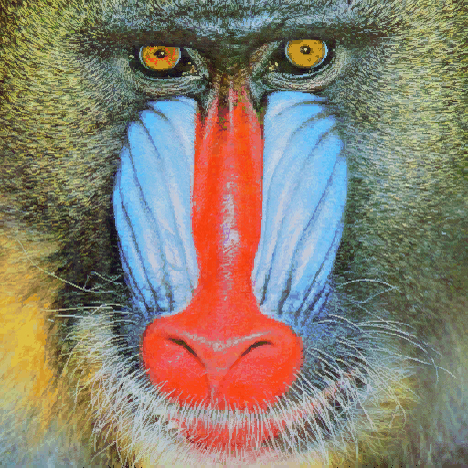

### Tabla de contenidos
- [Tarea 1 - Bordes en Canny](#tarea-1---bordes-en-canny)
- [Tarea 2 - Comparativa entre Canny y Sobel umbralizado](#tarea-2---comparativa-entre-canny-y-sobel-umbralizado)
- [Tarea 3 - Demostraciones con procesamiento de imagen](#tarea-3---demostraciones-con-procesamiento-de-imagen)
- [Fuentes consultadas](#fuentes-consultadas)

### Tarea 1 - Bordes en Canny

El objetivo de esta tarea es destacar las filas de la imagen con mayor número de bordes detectados.
  
Para ello, se aplica Canny sobre la imagen del mandril, y se realiza el recuento de píxeles blancos (bordes) por fila mediante `cv2.reduce`. El resultado se normaliza, obteniendo para cada fila el porcentaje de píxeles que corresponden a un borde.
  
A partir de este recuento se calculan:
- **`max_idx`**: el índice de la fila con mayor recuento de píxeles blancos.
- **`max90_idx`**: los índices de las filas cuyo recuento iguala o supera el 90% del recuento máximo.

Estas filas se resaltan sobre la imagen dibujando líneas: en rojo, la fila con recuento el máximo; y en amarillo, las filas que superan el 90% del máximo. Asimismo, se muestra junto a la imagen se muestra también el recuento de bordes en cada fila.

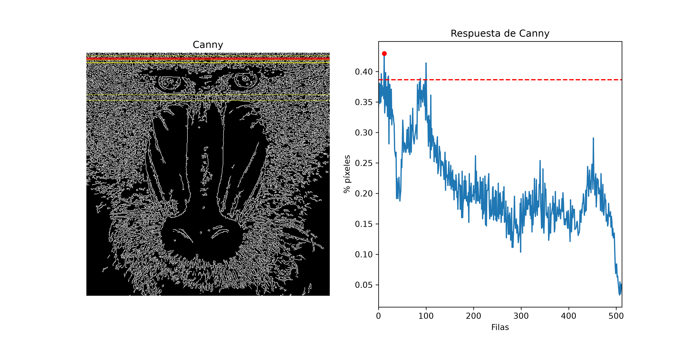
*Recuento de bordes por fila - Canny*

Se observa que las filas con mayor textura (por ejemplo, en la parte superior de la cabeza) producen más bordes y, por tanto, más píxeles de color blanco. Contrariamente a las zonas más homogéneas, como la parte inferior de la imagen, que generan un menor número de bordes.

### Tarea 2 - Comparativa entre Canny y Sobel umbralizado

En esta tarea se aplican distintos niveles de umbralizado a la imagen de Sobel, convertida a 8 bits. A partir de todas las imágenes generadas se observa el conteo de filas y columnas (al igual que en la [tarea 1](#tarea-1---bordes-en-canny)), comparándolos con los obtenidos sobre la imagen de Canny.
  
Para obtener la imagen de Sobel, se suaviza primero la imagen con un filtro gaussiano, y se combina el resultado de aplicar Sobel (`cv2.Sobel`) en horizontal y vertical. El resultado se convierte a 8 bits usando `cv2.convertScaleAbs`.
  
Para estudiar el impacto del umbral, se ha calculado, para cada valor de umbral entre 0 y 255, el número de filas y columnas que alcanzan el 90% del recuento máximo:

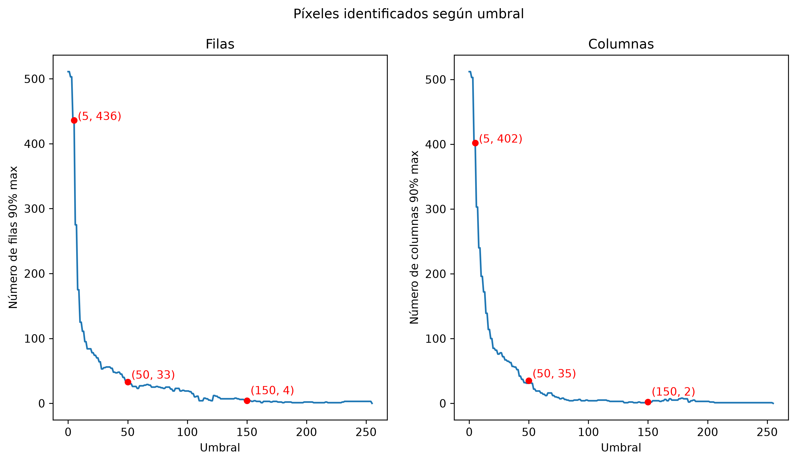
*Efectos en el cambio del umbral en Sobel*

Se aprecia que, al aumentar el umbral, el número de filas y columnas destacadas disminuye rápidamente. Esto se debe a que el umbral solo considera blancos los píxeles que superan su valor, por lo que umbrales más altos conservan únicamente los bordes más intensos.
  
Este efecto también puede observarse gráficamente, destacando las filas y columnas que alcanzan el 90% del máximo para Canny y para Sobel con umbrales de 5, 50 y 150:

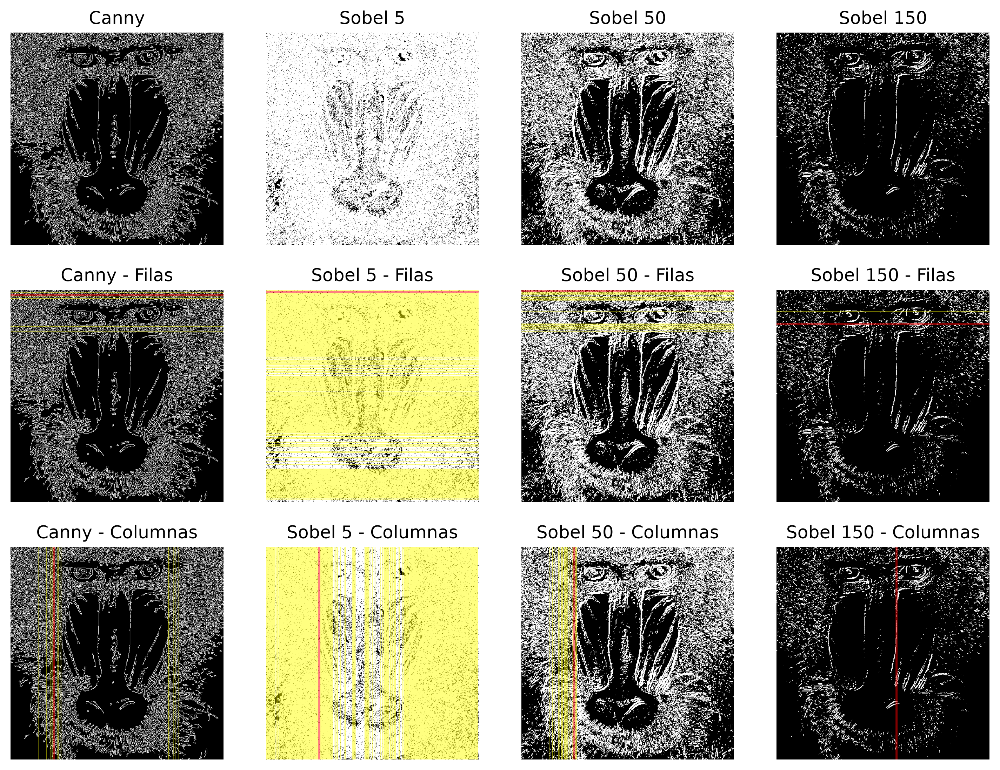
*Representación gráfica del efecto del cambio en el umbral*

Además, se ha buscado el umbral de Sobel que iguala a Canny en número de filas y columnas que alcanzan `0.9 × recuento[max_idx]`. Con este umbral, se comparan visualmente ambos resultados, mostrando también la diferencia absoluta (`cv2.absdiff`) entre ellos:

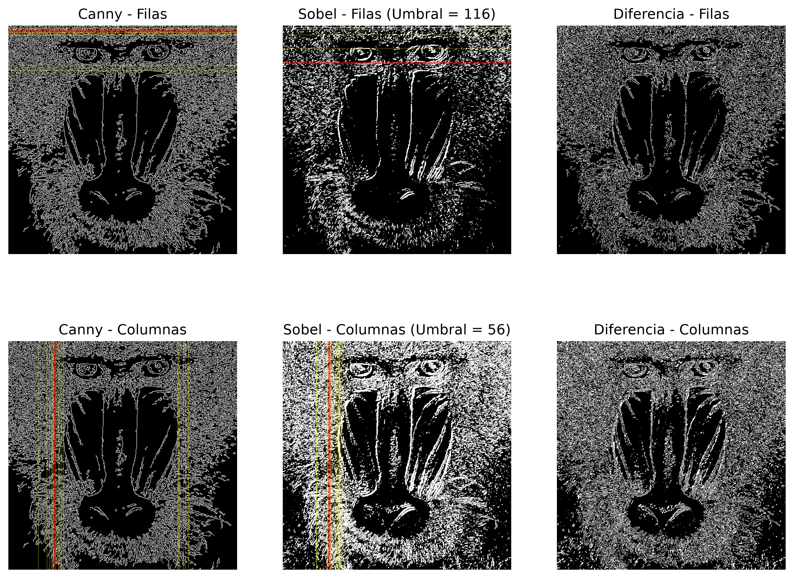
*Comparativa Canny-Sobel a igualdad de filas/columnas que alcanzan `0.9 × recuento[max_idx]`*

Al observar la gran diferencia de procesamiento de bordes entre Canny y Sobel, se ha buscado qué valor de umbral de Sobel minimiza esta diferencia:

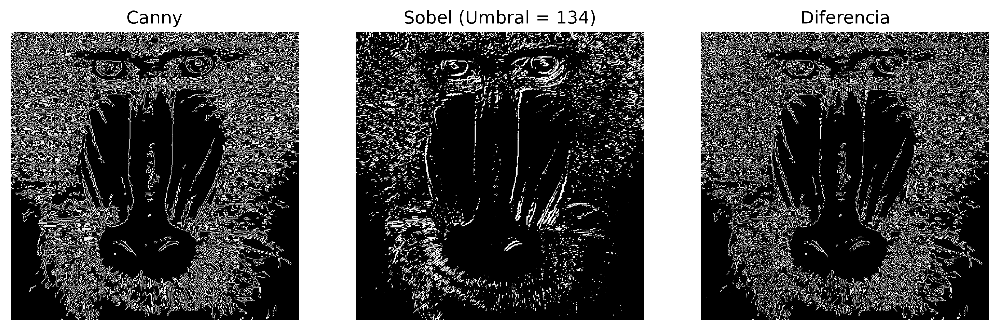
*Umbral que minimiza la diferencia Canny-Sobel*

Aun usando el umbral que minimiza la diferencia, la imagen obtenida por `cv2.absdiff` sigue manteniendo una gran cantidad de píxeles blancos, permitiendo incluso reconocer al mandril. Pocos píxeles de borde coinciden entre los dos métodos, lo que confirma la disparidad en el procesamiento de las imágenes.

### Tarea 3 - Demostraciones con procesamiento de imagen

En esta tarea se proponen varias demostraciones que combinan las técnicas de procesamiento de imagen estudiadas. Para realizarlas, se ha tomado inspiración de los vídeos vistos en clase ([My little piece of privacy](https://www.niklasroy.com/project/88/my-little-piece-of-privacy), [Messa di voce](https://www.youtube.com/watch?feature=shared&v=GfoqiyB1ndE) y [Virtual air guitar](https://www.youtube.com/watch?feature=shared&v=FIAmyoEpV5c)).
  
Como primer ejemplo se ha implementado un cambio de fondo sobre la entrada de la cámara. Para ello, se utiliza un sustractor de fondo (`cv2.createBackgroundSubtractorMOG2`), que genera en cada fotograma una máscara con los objetos en movimiento en los fotogramas anteriores.
  
Jugando con las operaciones de máscaras, se puede imitar a Homero Simpson desvaneciéndose en un arbusto:

[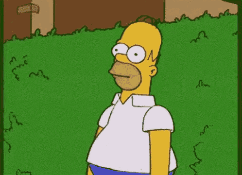](https://tenor.com/view/homer-simpson-bush-escape-im-out-gif-10058041)

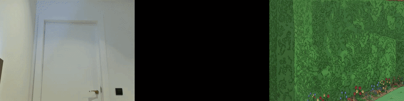

O simular que se está sobrevolando una ciudad:

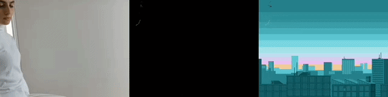

Si, adicionalmente, utilizamos sustracción de fotogramas, podemos imitar [*La creación de Adán*](https://es.wikipedia.org/wiki/La_creaci%C3%B3n_de_Ad%C3%A1n). 

[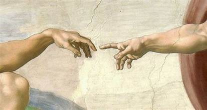](https://www.culturagenial.com/es/cuadro-la-creacion-de-adan-de-miguel-angel/)

Para ello, se realizan dos copias del modelo extraído (una normal y otra rotada 180º), para simular que la persona y su reflejo se tienden la mano.
  
La sustracción de fotogramas permite resaltar el movimiento, envolviendo las manos en un halo de color.

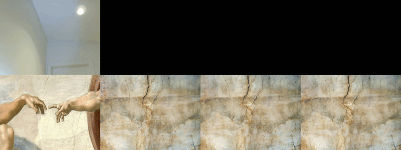

### Fuentes consultadas
#### Tarea 1
- [Documentación de OpenCV](https://docs.opencv.org/4.13.0/d2/de8/group__core__array.html)

- [Uso de `argmax()`](https://stackoverflow.com/questions/5469286/how-to-get-the-index-of-a-maximum-element-in-a-numpy-array-along-one-axis
)

- [Matplotlib plotting](https://www.w3schools.com/python/matplotlib_plotting.asp)

- [Matplotlib line](https://www.w3schools.com/python/matplotlib_line.asp)

- [Uso de `cv2.addWeighted()`](https://stackoverflow.com/questions/69432439/how-to-add-transparency-to-a-line-with-opencv-python)

- [Slicing and Basic using Numpy Operations](https://youtu.be/VXU4LSAQDSc)
#### Tarea 2
- [Image Thresholding using OpenCV](https://opencv.org/image-thresholding-using-opencv/)

- [Showing Points in a Plot in Python Matplotlib](https://www.tutorialspoint.com/article/showing-points-coordinate-in-a-plot-in-python-matplotlib)

- [Matplotlib - Subplots Axes and Figures](https://matplotlib.org/stable/gallery/subplots_axes_and_figures/index.html )

- [Matplotlib Plotting](https://www.w3schools.com/python/matplotlib_plotting.asp)

- [Matplotlib Line](https://www.w3schools.com/python/matplotlib_line.asp)

#### Tarea 3

- [Bitwise Operators](https://omes-va.com/operadores-bitwise/)

- [City Background - GIF](https://gifer.com/en/WBVi)

- [Load gif images with Python + OpenCV](https://www.linuxtut.com/en/a917c24509edfb48a828/)

- *Herramientas de IA para generar los fondos utilizados en la tarea*:
    - [Arbusto Homero Simpson](https://share.gemini.google/DvgGIu0OTG3d)
    - [La Creación de Adán](https://share.gemini.google/7501aBQC2Nv9) 